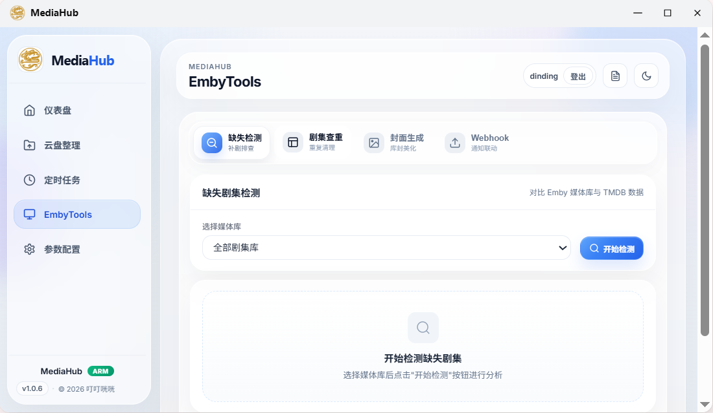
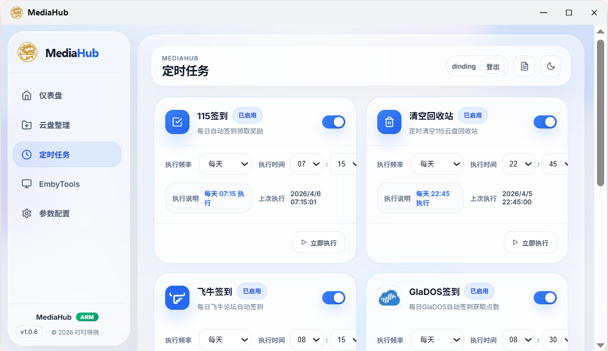
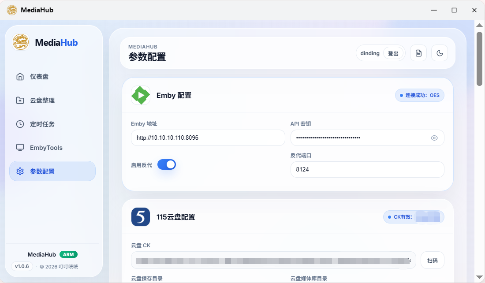

# MediaHub

<p align="center">
  <strong>为 Emby、115 云盘与飞牛 NAS 打造的一站式媒体管理面板</strong><br/>
  集媒体库总览、智能整理、任务自动化、系统认证与通知联动于一体。
</p>

<p align="center">
  
  
  
  
  
  
  
</p>

<p align="center">
  <sub>支持独立部署，也支持按飞牛 NAS 应用安装；界面已针对飞牛 iframe 与手机端做了适配优化。</sub>
</p>

---

## 功能亮点

- **媒体库总览**：查看 Emby 统计、最近入库、最近播放与封面
- **115 智能整理**：自动识别影视信息，结合 TMDB 生成目标路径并执行整理
- **Emby 工具集**：缺失检测、重复分析、封面生成、Webhook 日志
- **任务自动化**：签到、清理、自动整理统一管理，支持定时执行与手动触发
- **系统认证**：首次使用强制注册，后续统一登录后才能进入系统与受保护接口
- **通知联动**：支持 Telegram、微信 iLink Bot 与 Webhook 推送
- **飞牛应用适配**：提供 FPK 打包工作流，适配飞牛应用内嵌与小窗场景

## 为什么是 MediaHub

MediaHub 将媒体库查看、115 文件整理、任务调度、Webhook 联动、通知配置与系统认证整合到同一套界面，减少在多个脚本、容器和页面之间来回切换的成本，更适合家庭影音库、NAS 与 Homelab 场景下的日常维护。

## 核心能力

### 1. Dashboard 仪表盘
- 展示 Emby 媒体库统计
- 展示最近入库与最近播放
- 针对手机端、飞牛 iframe 与窄窗口做了卡片数量和比例优化

### 2. 115 云盘整理
- 浏览目录与待整理内容
- AI / TMDB 辅助识别媒体信息
- 自动重命名、分类、移动或复制
- 支持目录纠错、日志回看与自动整理策略

### 3. Emby Tools
- 缺失剧集检测
- 重复媒体分析与处理
- 封面生成与上传
- Webhook 日志查看与清理

### 4. 参数配置与通知
- Emby、115、TMDB、AI 配置集中管理
- Telegram 用户登录、会话保持与通知发送
- 微信 iLink Bot 登录、二维码拉起、通知发送与保活

### 5. 系统认证
- 无账号时自动进入注册流程
- 已有账号时必须登录后才能进入系统
- 页面路由与服务端 API 双重保护
- 登录成功 / 失败、首次注册成功 / 失败可发送 Telegram / 微信通知
- 使用 SQLite + scrypt + HttpOnly Session Cookie 实现本地认证

## 界面预览

<table>
  <tr>
    <td align="center" width="50%"><strong>Dashboard</strong><br/></td>
    <td align="center" width="50%"><strong>Organize</strong><br/></td>
  </tr>
  <tr>
    <td align="center" width="50%"><strong>Emby Tools</strong><br/></td>
    <td align="center" width="50%"><strong>Tasks</strong><br/></td>
  </tr>
  <tr>
    <td align="center" colspan="2"><strong>Settings</strong><br/></td>
  </tr>
</table>

## 页面结构

当前主要页面：

- [仪表盘](pages/index.vue)
- [云盘整理](pages/organize.vue)
- [定时任务](pages/tasks.vue)
- [Emby Tools](pages/emby-tools.vue)
- [参数配置](pages/settings.vue)
- [登录页](pages/login.vue)
- [注册页](pages/register.vue)

## 适用场景

- 家庭影音库 / NAS / Homelab 的统一控制台
- 115 下载目录的自动归档、重命名与整理
- Emby 媒体库的日常维护、巡检与排障
- 需要签到、清理与通知联动的个人媒体自动化流程
- 需要以飞牛应用方式安装和使用的 NAS 用户

## 认证与安全说明

MediaHub 目前内置一套轻量系统认证：

- 首次使用时，系统会检测数据库中是否已有账号
- 若没有账号，会强制进入注册页创建系统账号
- 若已有账号，访问业务页面前必须先登录
- 未登录状态下，受保护的页面与 `/api` 接口都会被拦截
- 密码不会明文保存，服务端使用 `scrypt` + 随机盐进行哈希
- 登录态通过 HttpOnly Session Cookie 管理，并支持“记住我”持久会话

> 说明：这套认证更偏向 NAS / 家庭内网场景下的系统入口保护，不是多租户权限系统。

## 通知能力

当前支持：

- **Telegram**：支持用户登录、会话保持、命令处理、通知发送
- **微信 iLink Bot**：支持二维码登录、状态保持、通知发送
- **Webhook / 日志联动**：用于 Emby Webhook 等场景

认证通知模板会包含：
- 操作类型（注册 / 登录）
- 用户名
- 客户端 IP
- 时间
- 成功或失败状态

## 部署方式

### 本地开发

```bash
npm install
npm run dev
```

默认端口：`3030`

### 生产构建

```bash
npm install
npm run build
```

Nuxt 生产构建产物位于：

- `.output/server`
- `.output/public`

### 飞牛 NAS / FPK 打包

仓库内已包含飞牛应用打包目录与 GitHub Actions 工作流：

- 飞牛应用目录：`MediaHub/mediahub/`
- 打包工作流：`.github/workflows/package.yml`

GitHub Actions 会自动：

1. 执行 `npm run build`
2. 将 `.output/server` 与 `.output/public` 复制到飞牛包目录
3. 调用 `fnpack` 构建 `.fpk`

飞牛运行时依赖：

- 内置 Node.js 运行时（构建时自动下载）
- 应用端口：`3030`
- 数据目录：`${TRIM_PKGVAR}/data`
- 日志目录：`${TRIM_PKGVAR}/logs`

## 数据存储

项目使用 SQLite 持久化配置、整理记录、认证信息与部分缓存数据。

默认数据库位置：

- 飞牛应用环境：`${TRIM_PKGVAR}/data/config.db`
- 普通环境：`./data/config.db`

认证相关表：

- `system_users`
- `auth_sessions`

## 技术栈

- **Frontend:** Nuxt 3, Vue 3, TypeScript
- **UI:** @nuxt/ui
- **Server:** Nitro / h3
- **Database:** better-sqlite3 / SQLite
- **Scheduler:** node-cron
- **Third-party:** Emby API, 115 云盘, TMDB, Telegram, 微信 iLink Bot

## 项目特性概览

- 玻璃卡片风格 UI
- 针对飞牛 iframe、小窗与手机端的布局优化
- SQLite 本地持久化
- 生产环境可打包为飞牛 FPK 应用
- 支持系统登录认证与接口保护
- 支持 Telegram / 微信通知联动

## License

本项目采用 **MIT License**。

你可以在 [LICENSE](./LICENSE) 查看完整授权内容。
